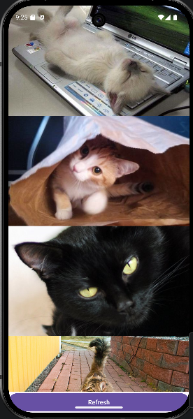

# Cat Gallery

Cat Gallery is a simple Android application developed in Kotlin using XML Views.

The app retrieves random cat images from The Cat API and displays them in a RecyclerView.

## Features

- Fetch cat images from a public API
- Display images in a RecyclerView
- Refresh images with a button
- Show a loading indicator while loading
- Simple MVVM architecture

## API Used

The Cat API

Endpoint:
https://api.thecatapi.com/v1/images/search?limit=20

## Technologies

- Kotlin
- XML Views
- RecyclerView
- Retrofit
- Glide
- MVVM

## How to Run

1. Open the project in Android Studio.
2. Sync Gradle.
3. Build the project.
4. Run the app on an emulator or Android device.

## Screenshots

